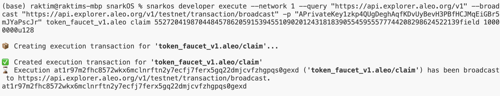
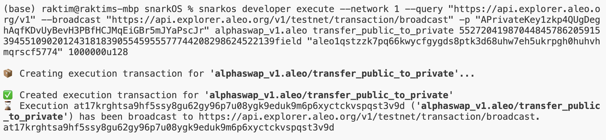
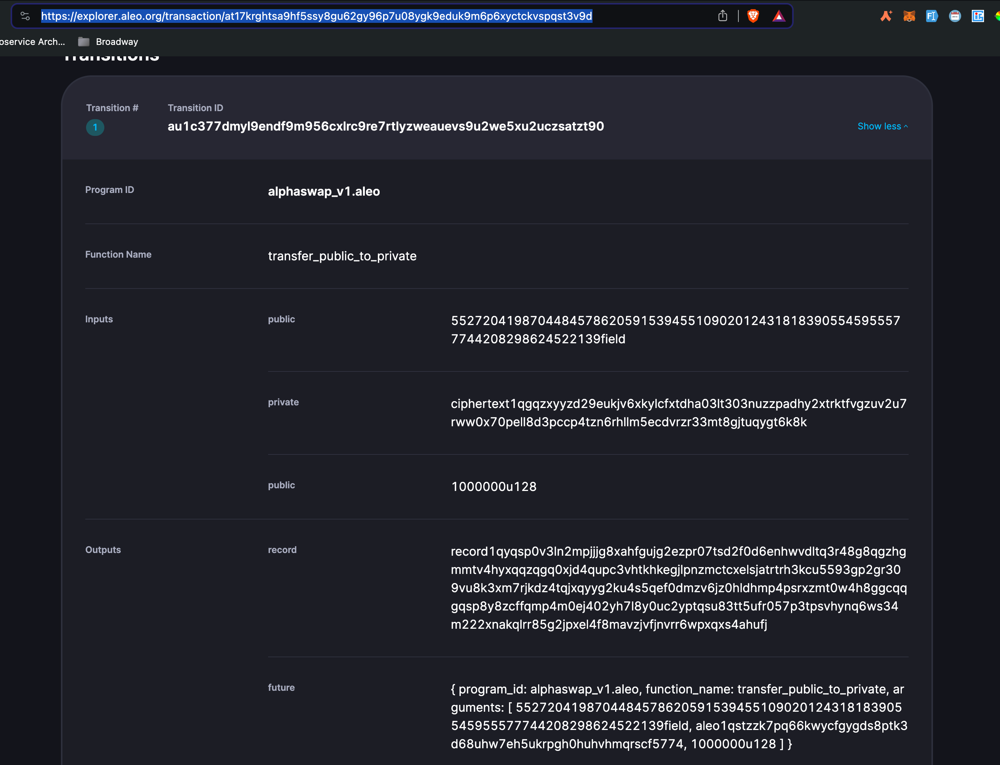
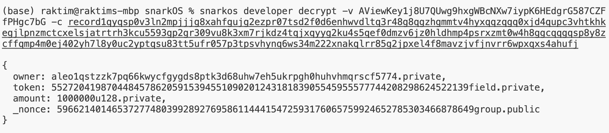
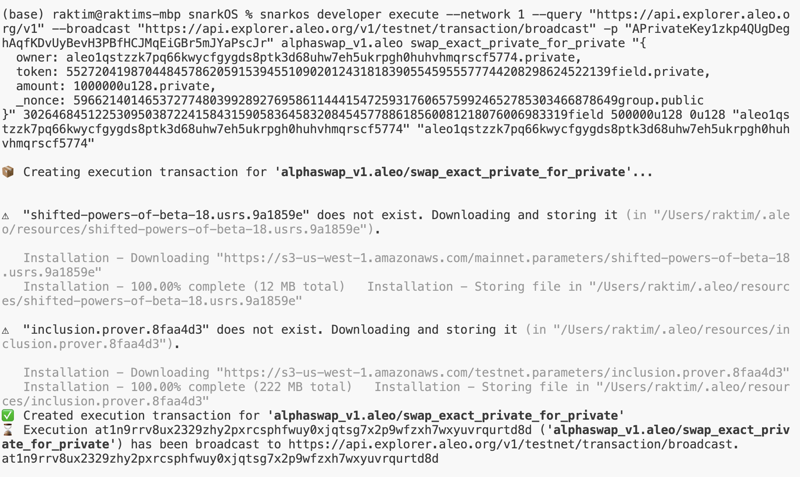
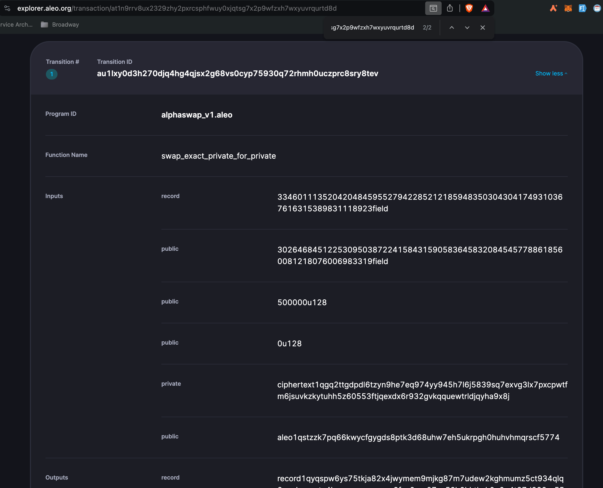

# Steps

## Tasks

- Complete a private swap transaction with `snarkos` command line.

## Solution

1.

- snarkos account new
- Output:

```
Private Key  APrivateKey1zkp4QUgDeghAqfKDvUyBevH3PBfHCJMqEiGBr5mJYaPscJr
View Key  AViewKey1j8U7QUwg9hxgWBcNXw7iypK6HEdgrG587CZFfPHgc7bG
Address  aleo1qstzzk7pq66kwycfgygds8ptk3d68uhw7eh5ukrpgh0huhvhmqrscf5774
```

2.

- Code:

```
snarkos developer execute --network 1 --query "https://api.explorer.aleo.org/v1" --broadcast "https://api.explorer.aleo.org/v1/testnet/transaction/broadcast" -p "APrivateKey1zkp4QUgDeghAqfKDvUyBevH3PBfHCJMqEiGBr5mJYaPscJr" token_faucet_v1.aleo claim 5527204198704484578620591539455109020124318183905545955577744208298624522139field 10000000u128
```

- Image:



3.

- Code:

  ```
  snarkos developer execute --network 1 --query "https://api.explorer.aleo.org/v1" --broadcast "https://api.explorer.aleo.org/v1/testnet/transaction/broadcast" -p "APrivateKey1zkp4QUgDeghAqfKDvUyBevH3PBfHCJMqEiGBr5mJYaPscJr" alphaswap_v1.aleo transfer_public_to_private 5527204198704484578620591539455109020124318183905545955577744208298624522139field "aleo1qstzzk7pq66kwycfgygds8ptk3d68uhw7eh5ukrpgh0huhvhmqrscf5774" 1000000u128
  ```

- Output:
  at17krghtsa9hf5ssy8gu62gy96p7u08ygk9eduk9m6p6xyctckvspqst3v9d

- Image:
  

4.

- Search in aleo explorer

https://explorer.aleo.org/transaction/at17krghtsa9hf5ssy8gu62gy96p7u08ygk9eduk9m6p6xyctckvspqst3v9d

- Copy the output record

```
record1qyqsp0v3ln2mpjjjg8xahfgujg2ezpr07tsd2f0d6enhwvdltq3r48g8qgzhgmmtv4hyxqqzqgq0xjd4qupc3vhtkhkegjlpnzmctcxelsjatrtrh3kcu5593gp2gr309vu8k3xm7rjkdz4tqjxqyyg2ku4s5qef0dmzv6jz0hldhmp4psrxzmt0w4h8ggcqqgqsp8y8zcffqmp4m0ej402yh7l8y0uc2yptqsu83tt5ufr057p3tpsvhynq6ws34m222xnakqlrr85g2jpxel4f8mavzjvfjnvrr6wpxqxs4ahufj

```

- Image:



5. Decrypt record

- Code:

  ```
  snarkos developer decrypt -v <VIEW_KEY> -c <RECORD_CIPHERTEXT>
  ```

- Use case

```
snarkos developer decrypt -v AViewKey1j8U7QUwg9hxgWBcNXw7iypK6HEdgrG587CZFfPHgc7bG -c record1qyqsp0v3ln2mpjjjg8xahfgujg2ezpr07tsd2f0d6enhwvdltq3r48g8qgzhgmmtv4hyxqqzqgq0xjd4qupc3vhtkhkegjlpnzmctcxelsjatrtrh3kcu5593gp2gr309vu8k3xm7rjkdz4tqjxqyyg2ku4s5qef0dmzv6jz0hldhmp4psrxzmt0w4h8ggcqqgqsp8y8zcffqmp4m0ej402yh7l8y0uc2yptqsu83tt5ufr057p3tpsvhynq6ws34m222xnakqlrr85g2jpxel4f8mavzjvfjnvrr6wpxqxs4ahufj
```

- Result:

```
{
  owner: aleo1qstzzk7pq66kwycfgygds8ptk3d68uhw7eh5ukrpgh0huhvhmqrscf5774.private,
  token: 5527204198704484578620591539455109020124318183905545955577744208298624522139field.private,
  amount: 1000000u128.private,
  _nonce: 5966214014653727748039928927695861144415472593176065759924652785303466878649group.public
}
```

- Image:
  

6. Private Swap

- Code:

```
  snarkos developer execute --network 1 --query "https://api.explorer.aleo.org/v1" --broadcast "https://api.explorer.aleo.org/v1/testnet/transaction/broadcast" -p "APrivateKey1zkp4QUgDeghAqfKDvUyBevH3PBfHCJMqEiGBr5mJYaPscJr" alphaswap_v1.aleo swap_exact_private_for_private "{
  owner: aleo1qstzzk7pq66kwycfgygds8ptk3d68uhw7eh5ukrpgh0huhvhmqrscf5774.private,
  token: 5527204198704484578620591539455109020124318183905545955577744208298624522139field.private,
  amount: 1000000u128.private,
  _nonce: 5966214014653727748039928927695861144415472593176065759924652785303466878649group.public
  }" 3026468451225309503872241584315905836458320845457788618560081218076006983319field 500000u128 0u128 "aleo1qstzzk7pq66kwycfgygds8ptk3d68uhw7eh5ukrpgh0huhvhmqrscf5774" "aleo1qstzzk7pq66kwycfgygds8ptk3d68uhw7eh5ukrpgh0huhvhmqrscf5774"
```

- Output:

  ```
  at1n9rrv8ux2329zhy2pxrcsphfwuy0xjqtsg7x2p9wfzxh7wxyuvrqurtd8d
  ```

- Image:
  

- URL:
  https://explorer.aleo.org/transaction/at1n9rrv8ux2329zhy2pxrcsphfwuy0xjqtsg7x2p9wfzxh7wxyuvrqurtd8d

- Image:


