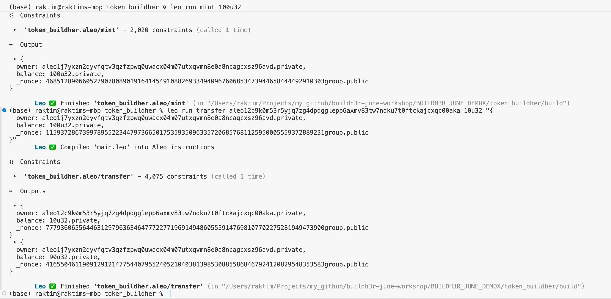

# ALEO/DEMOX WORKSHOP

# TASK

1. Implement a transfer function that takes a receiver, amount, and token, and returns two token records.
2. Deploy your Aleo program on testnet.

# Solution

- For task 1:
  

- For task 2:

Here's the explorer url that shows the deployed transaction
https://explorer.aleo.org/transaction/at18h9c0xl46t9czz67wp6z9rfv7a9lr82ypqdykrpasuv0jcat0v9qkyqfw6
