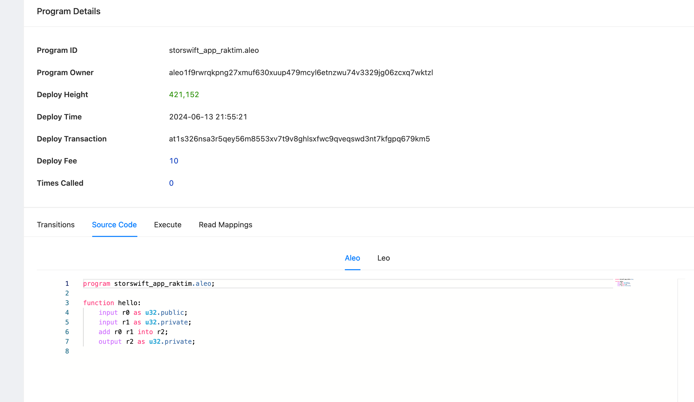

# Task

- Deploy your project to GitHub.

# Solution

1. create the leo project
2. deploy the project using the url (https://testnetbeta.aleo123.io/programs)

- Image

- URL

https://testnetbeta.aleo123.io/programDetail/storswift_app_raktim.aleo
